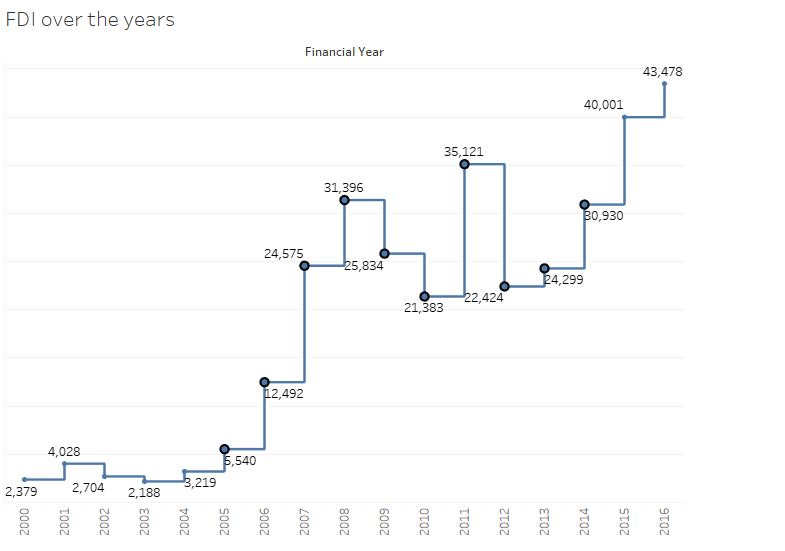
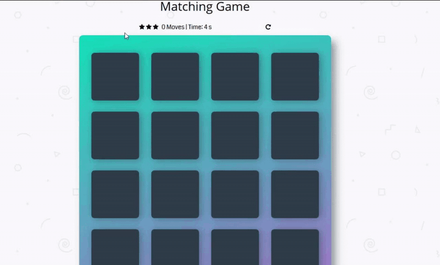

## Portfolio

---

### Data Analysis Projects

[Sentiment analysis of tweets about US Airlines](/sample_page_9)

[Stock Market Analysis](/sample_page)

---
[Foreign direct investment](/sample_page_1)

---
[Global Superstore Performance](/sample_page_3)

---
### Machine Learning Projects
[Board Game Review Prediction](/sample_page_7)

[Credit-Card-Fraud-Detection](/sample_page_5)

[Uber data Analysis](/sample_page_6)

[Image-Compression-using-K-Means](/sample_page_8)

---

### Side projects
[Card matching game](/sample_page_4)

---
<!--
 <a href="https://github.com/evanca/quick-portfolio">evanca</a>
-->
<!-- Remove above link if you don't want to attibute -->
