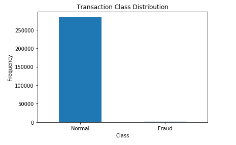
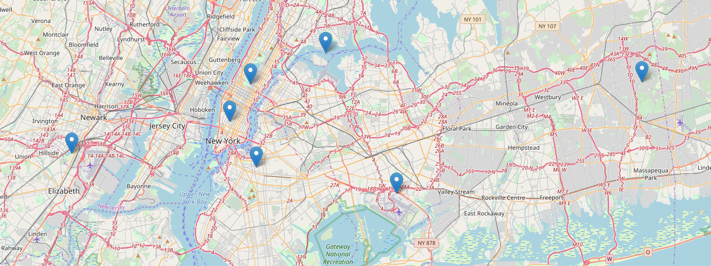
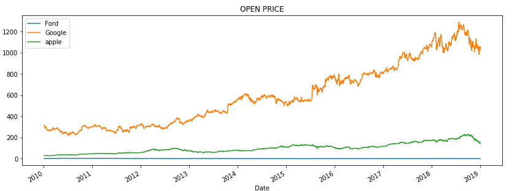
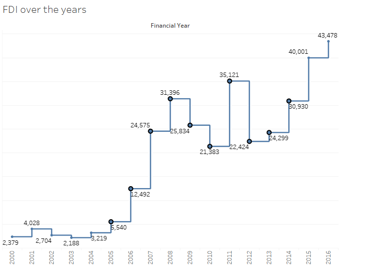
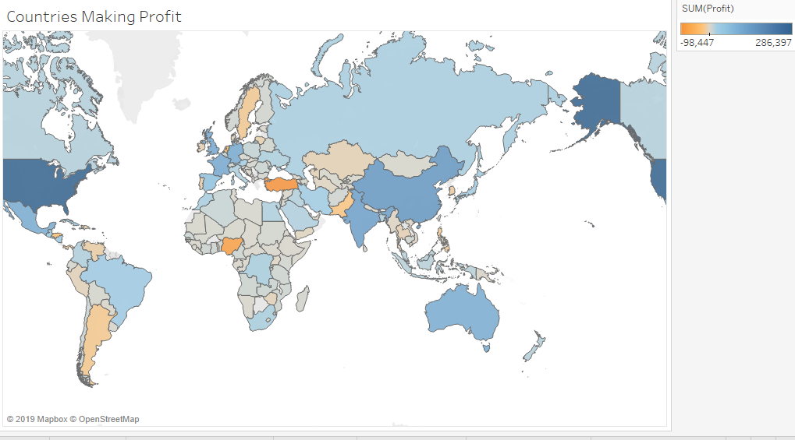
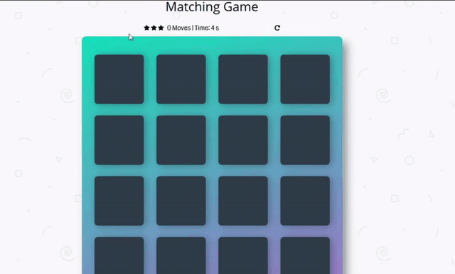

## About

Data scientist with an MS in Data Science from UAB. I build analytics dashboards, machine learning models, and interactive apps — from exploratory analysis to deployed Streamlit tools. Open to data science, analytics, and data engineering roles.

  
<strong>Languages &amp; tools:</strong> Python, SQL, pandas, scikit-learn, Tableau, Streamlit, Jupyter

  
<strong>Focus areas:</strong> Predictive modeling, visualization, clustering, NLP, anomaly detection

  

    <h2>Featured Projects</h2>
    

      
Scroll or use arrows →

      <button class="featured-btn" id="featured-prev" type="button" aria-label="Scroll featured projects left">‹</button>
      <button class="featured-btn" id="featured-next" type="button" aria-label="Scroll featured projects right">›</button>
    

  

  

    

      
      

        <h3><a href="/sample_page_9">US Airlines Sentiment Analysis</a></h3>
        <ul class="tag-list"><li>Streamlit</li><li>NLP</li></ul>
        
Interactive Twitter sentiment dashboard with maps and word clouds.

        <a class="project-link" href="/sample_page_9">View →</a>
      

    

    

      
      

        <h3><a href="/sample_page_10">Bug Defender — Cloud Antivirus</a></h3>
        <ul class="tag-list"><li>Python</li><li>Cloud</li></ul>
        
Multi-engine cloud antivirus using N-Version programming.

        <a class="project-link" href="/sample_page_10">View →</a>
      

    

    

      
      

        <h3><a href="/sample_page_5">Credit Card Fraud Detection</a></h3>
        <ul class="tag-list"><li>ML</li><li>Anomaly Detection</li></ul>
        
LOF and Isolation Forest on imbalanced transaction data.

        <a class="project-link" href="/sample_page_5">View →</a>
      

    

    

      
      

        <h3><a href="/sample_page_6">Uber NYC Pickup Analysis</a></h3>
        <ul class="tag-list"><li>K-Means</li><li>Geospatial</li></ul>
        
800K+ pickups clustered to find high-demand ride hubs.

        <a class="project-link" href="/sample_page_6">View →</a>
      

    

    

      
      

        <h3><a href="/sample_page_7">Board Game Review Prediction</a></h3>
        <ul class="tag-list"><li>Random Forest</li><li>Regression</li></ul>
        
Predicts game ratings — Random Forest beats Linear Regression.

        <a class="project-link" href="/sample_page_7">View →</a>
      

    

  

<h2 class="section-heading">Data Analysis Projects</h2>

  
  

    <h3><a href="/sample_page_9">US Airlines Sentiment Analysis</a></h3>
    <ul class="tag-list"><li>Python</li><li>Streamlit</li><li>NLP</li></ul>
    
Interactive dashboard analyzing traveler sentiment on Twitter across major US airlines.

    <a class="project-link" href="/sample_page_9">View project →</a>
  

  
  

    <h3><a href="/sample_page">Stock Market Analysis</a></h3>
    <ul class="tag-list"><li>Python</li><li>pandas</li><li>Technical Analysis</li></ul>
    
Fundamental and technical analysis of historical stock data for major tech companies.

    <a class="project-link" href="/sample_page">View project →</a>
  

  
  

    <h3><a href="/sample_page_1">Foreign Direct Investment in India</a></h3>
    <ul class="tag-list"><li>Tableau</li><li>Forecasting</li></ul>
    
17 years of sector-wise FDI trends, growth patterns, and year-ahead forecasts.

    <a class="project-link" href="/sample_page_1">View project →</a>
  

  
  

    <h3><a href="/sample_page_3">Global Superstore Performance</a></h3>
    <ul class="tag-list"><li>Tableau</li><li>Business Analytics</li></ul>
    
Profit and loss analysis across markets, categories, and shipping patterns.

    <a class="project-link" href="/sample_page_3">View project →</a>
  

<h2 class="section-heading">Machine Learning Projects</h2>

  
  

    <h3><a href="/sample_page_7">Board Game Review Prediction</a></h3>
    <ul class="tag-list"><li>scikit-learn</li><li>Random Forest</li></ul>
    
Predicts average board game ratings with Linear Regression and Random Forest on Kaggle data.

    <a class="project-link" href="/sample_page_7">View project →</a>
  

  
  

    <h3><a href="/sample_page_5">Credit Card Fraud Detection</a></h3>
    <ul class="tag-list"><li>Anomaly Detection</li><li>LOF</li><li>Isolation Forest</li></ul>
    
Detects fraudulent transactions on imbalanced credit card data.

    <a class="project-link" href="/sample_page_5">View project →</a>
  

  
  

    <h3><a href="/sample_page_6">Uber NYC Pickup Analysis</a></h3>
    <ul class="tag-list"><li>K-Means</li><li>Clustering</li><li>Geospatial</li></ul>
    
K-means clustering of 800K+ NYC Uber pickups to identify ride hubs and demand patterns.

    <a class="project-link" href="/sample_page_6">View project →</a>
  

  
  

    <h3><a href="/sample_page_8">Image Compression with K-Means</a></h3>
    <ul class="tag-list"><li>K-Means</li><li>Computer Vision</li></ul>
    
Compresses images by clustering pixel colors, balancing quality and file size.

    <a class="project-link" href="/sample_page_8">View project →</a>
  

<h2 class="section-heading">Software &amp; Side Projects</h2>

  
  

    <h3><a href="/sample_page_10">Bug Defender — Cloud Antivirus</a></h3>
    <ul class="tag-list"><li>Python</li><li>Cloud</li><li>N-Version Programming</li></ul>
    
Cloud-based antivirus using three engines in parallel for higher malware detection rates.

    <a class="project-link" href="/sample_page_10">View project →</a>
  

  
  

    <h3><a href="/sample_page_4">Memory Card Matching Game</a></h3>
    <ul class="tag-list"><li>JavaScript</li><li>HTML</li><li>CSS</li></ul>
    
Interactive memory game with move tracking, star ratings, and a timer.

    <a class="project-link" href="/sample_page_4">View project →</a> ·
    <a class="project-link" href="https://codepen.io/smit10/project/full/Xbqmpa">Play live →</a>
  

  
<strong>Get in touch</strong>

  

    <a href="https://github.com/smit-collab">GitHub</a> ·
    <a href="https://public.tableau.com/profile/smit106059">Tableau</a> ·
    <a href="https://codepen.io/smit10">CodePen</a>
  

  
<em>Upload your resume as <code>pdf/resume.pdf</code> and add a link here when ready.</em>

