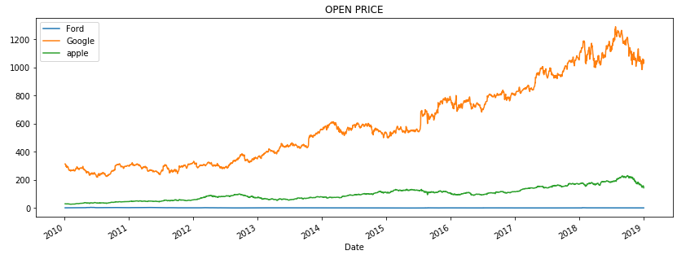
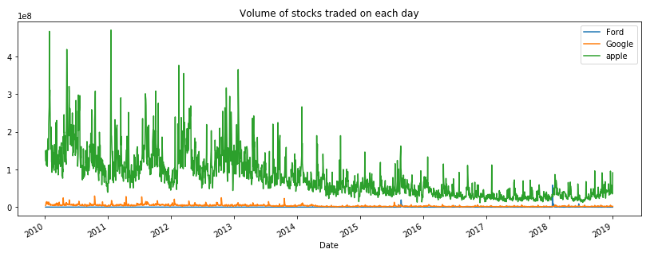
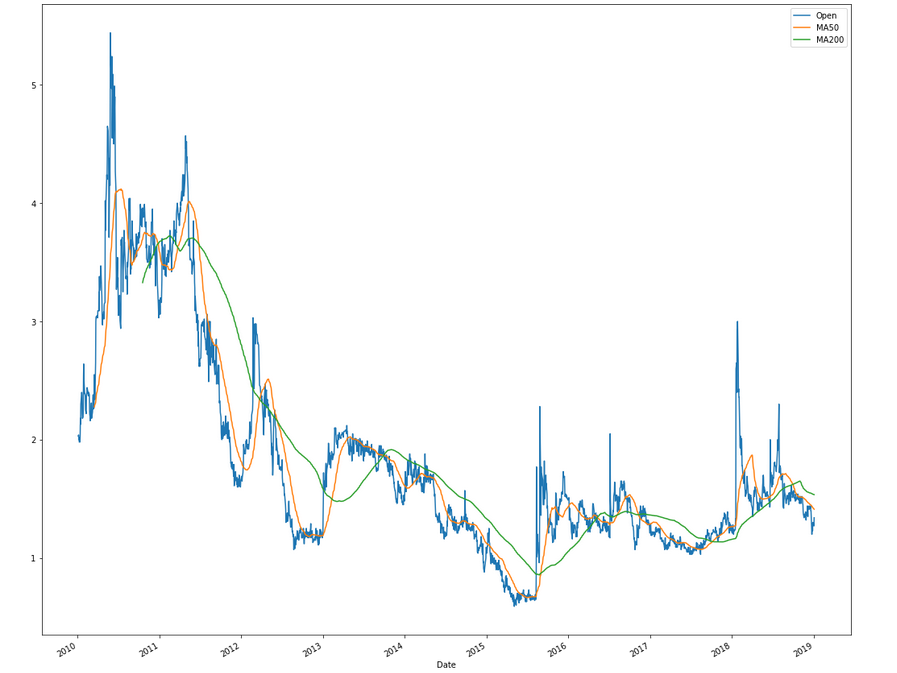
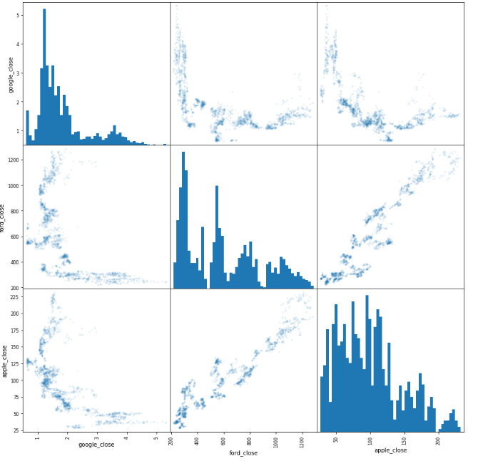
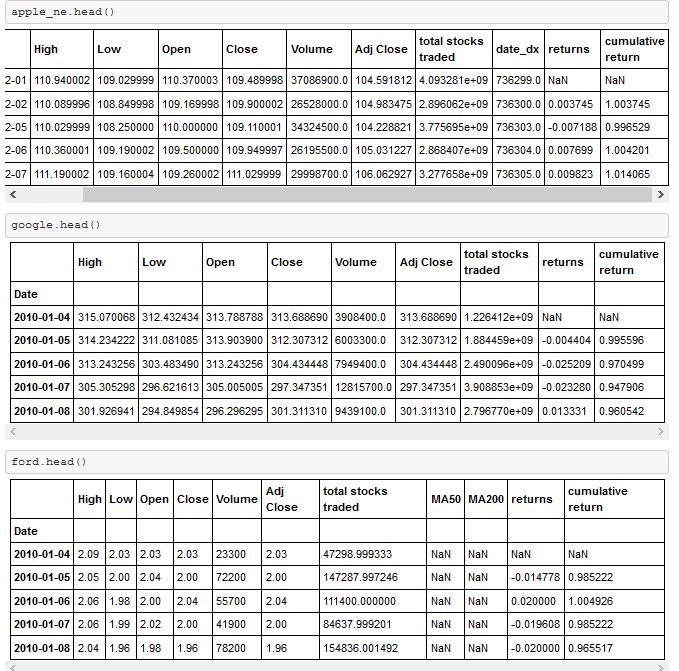
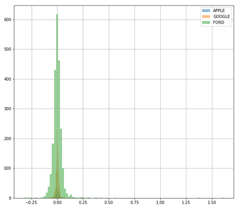

## Stock Market Analysis

Analyzed historical stock data from Yahoo Finance for publicly listed tech companies — Google, Ford, Apple, and Microsoft. Combined fundamental and technical analysis to uncover price trends, trading volume patterns, and return relationships.

**Tools:** Python, pandas, matplotlib, Yahoo Finance data  
**Repo:** [GitHub](https://github.com/smit-collab/Stock-Market-Analysis)

---

## Key Visualizations

### Open price of all stocks

### Volume of stocks traded per day

### Moving averages

### Stock relationships (scatter plot)

### Cumulative returns

### Comparing returns across stocks

---

## Links

- [GitHub repository](https://github.com/smit-collab/Stock-Market-Analysis)
