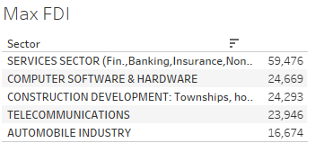
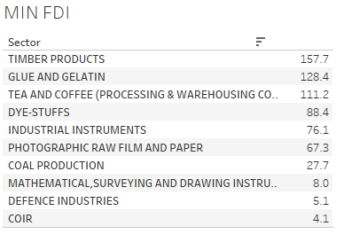
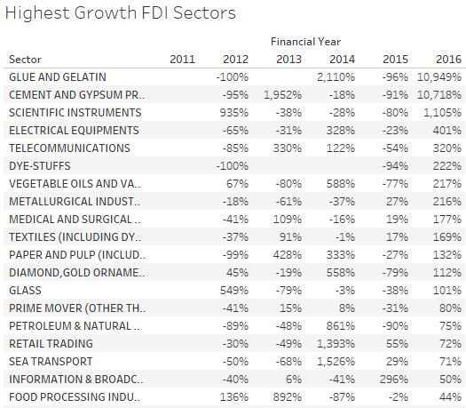
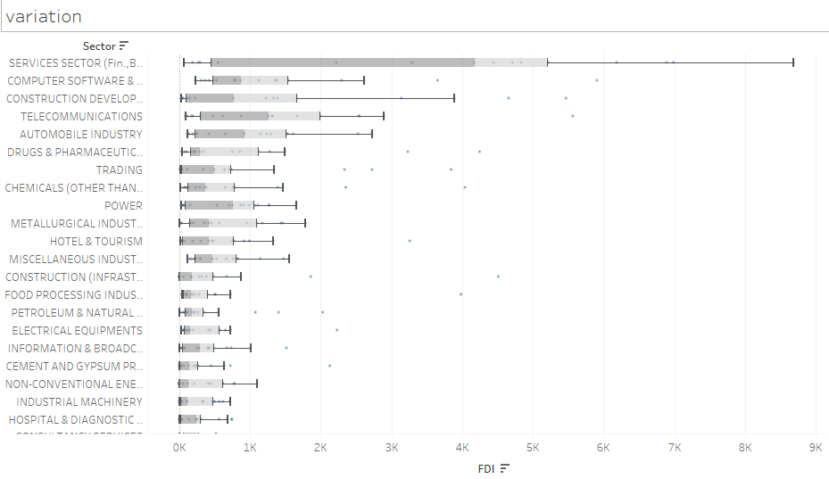
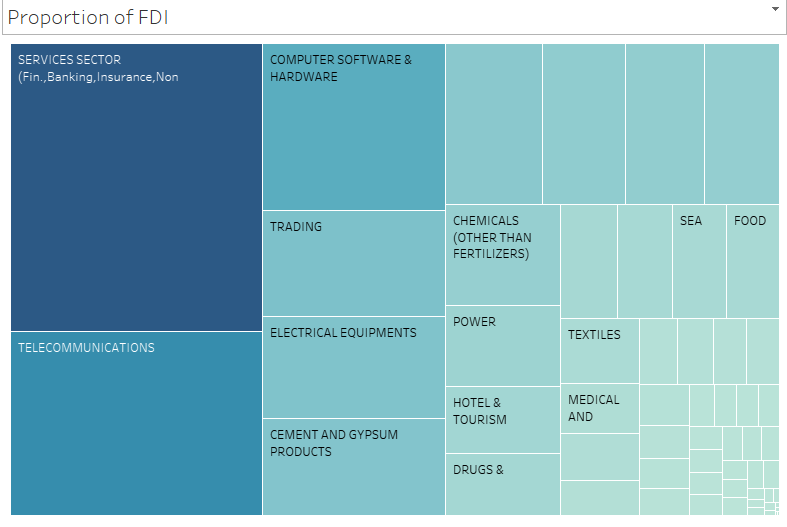
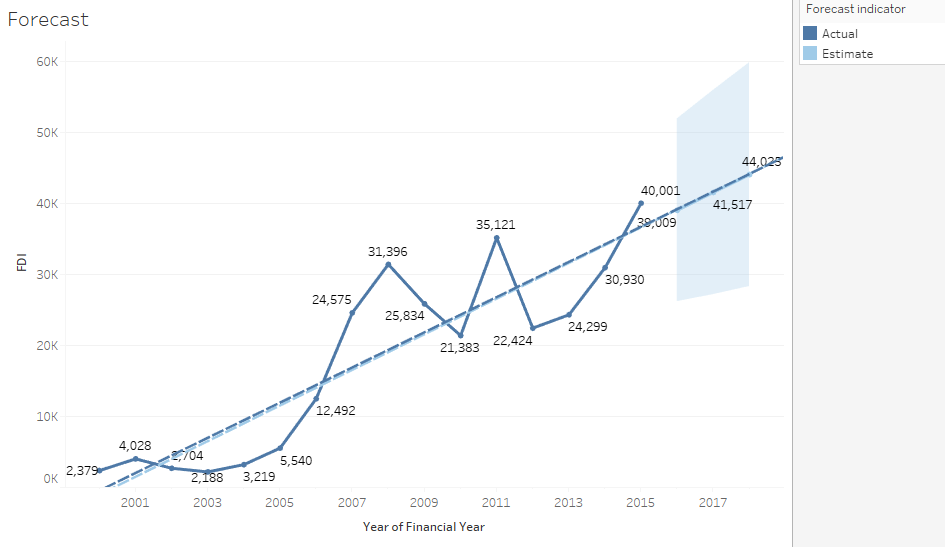

## Foreign Direct Investment in India

Built two **Tableau dashboards** analyzing 17 years of sector-wise FDI data in India (2000–2017). Tracked how foreign investment shifted across sectors and over time, including forecasts for the following year.

**Tools:** Tableau, data visualization, time-series forecasting  
**Live dashboards:** [Dashboard 1](https://public.tableau.com/profile/smit106059#!/vizhome/ForeigndirectinvestmentDashboard1/Dashboard1) · [Dashboard 2](https://public.tableau.com/profile/smit106059#!/vizhome/ForeigndirectinvestmentDashboard2/Dashboard2)  
**Repo:** [GitHub](https://github.com/smit-collab/Tableau-Visualizations)

---

## Key Visualizations

### Maximum FDI

### Minimum FDI

### FDI over the years

### Highest growth FDI sectors

### Variation of FDI across sectors

### Proportion of FDI

### Forecast for next year

---

## Links

- [Tableau Dashboard 1](https://public.tableau.com/profile/smit106059#!/vizhome/ForeigndirectinvestmentDashboard1/Dashboard1)
- [Tableau Dashboard 2](https://public.tableau.com/profile/smit106059#!/vizhome/ForeigndirectinvestmentDashboard2/Dashboard2)
- [GitHub repository](https://github.com/smit-collab/Tableau-Visualizations)
