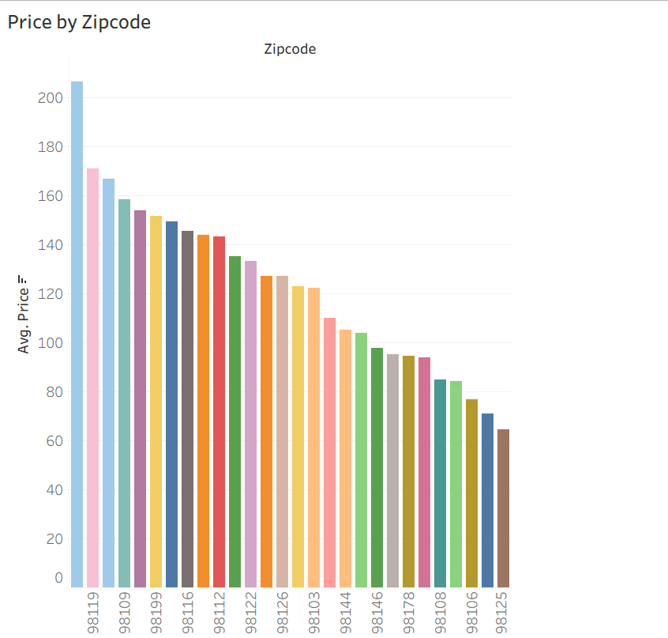
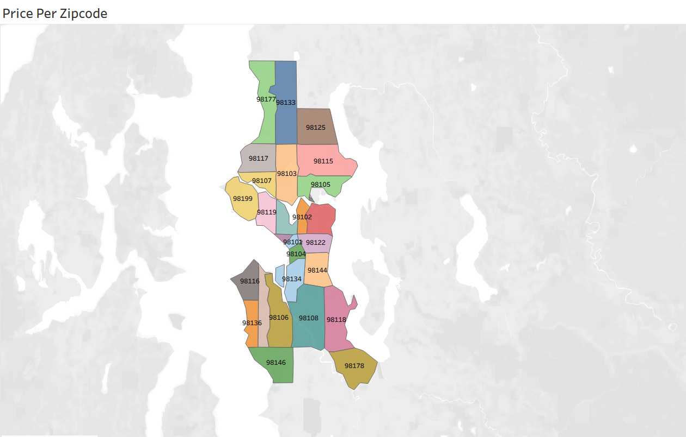
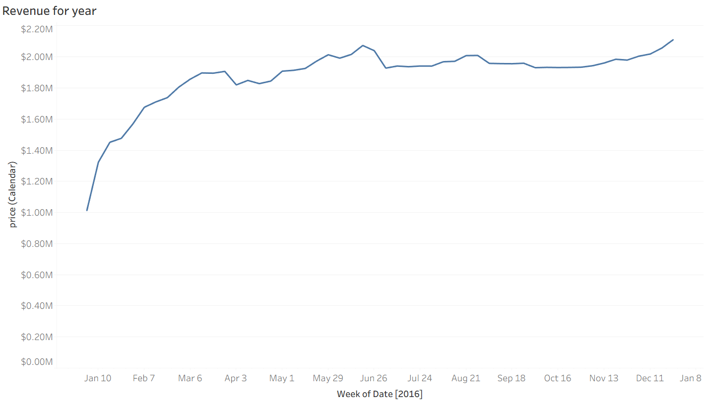
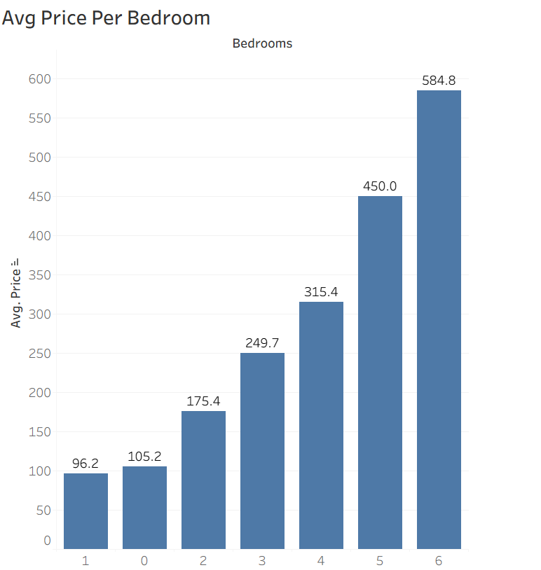
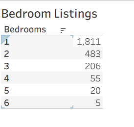
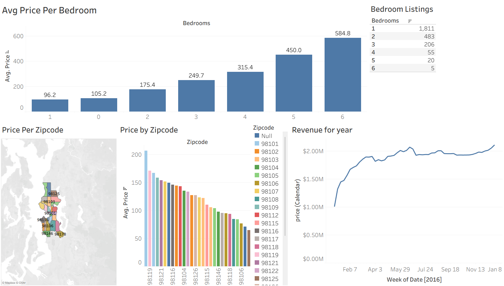

## Airbnb Listing Analysis

Explored **Seattle Airbnb listing data** to understand how price, inventory, and revenue vary by neighborhood, bedroom count, and time. Built an interactive **Tableau dashboard** combining geospatial maps, bar charts, and time-series views to surface pricing hotspots and market trends.

**Tools:** Tableau, geospatial analysis, pricing analytics  
**Live dashboard:** [Airbnb Listings Dashboard](https://public.tableau.com/views/AirbnbListings_17831001032500/Dashboard1)  

---

## Key Visualizations

### Price by zip code
Average nightly price ranked across Seattle zip codes. **98119** leads at over $200/night while more affordable areas fall near $65–$75.

### Price per zip code (map)
Choropleth map of Seattle neighborhoods colored by zip code, making it easy to compare pricing patterns across the city at a glance.

### Revenue for year
Weekly calendar revenue through 2016. Strong growth in Q1, a summer peak near **$2.1M**, and a year-end surge above **$2.15M**.

### Avg price per bedroom
Clear price ladder from studios (~$105) through 6-bedroom homes (~$585); larger properties command a steep premium for groups and families.

### Bedroom listings
Inventory is dominated by **1-bedroom** units (1,811 listings), with supply dropping sharply for 4+ bedroom properties.

### Full dashboard
All five views combined into one interactive dashboard with filters for exploring price, location, and revenue together.

---

## Links

- [Tableau dashboard](https://public.tableau.com/views/AirbnbListings_17831001032500/Dashboard1)
