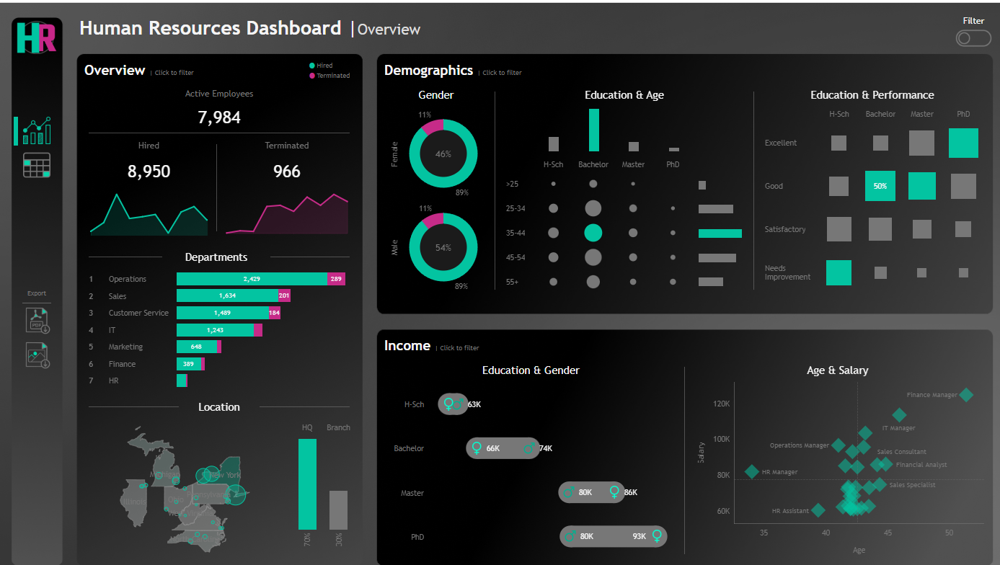
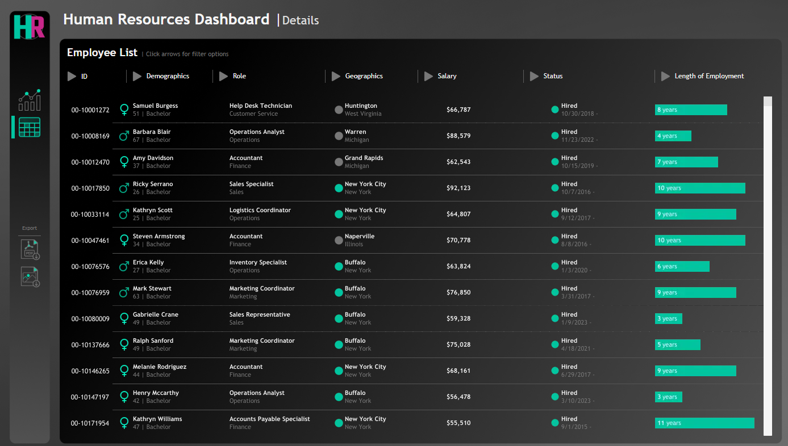

## Organization Dashboard

Built a two-part **Tableau HR analytics suite** for workforce planning: a summary dashboard for leadership KPIs and demographics, and a details view for drilling into individual employee records. Together they cover headcount, hiring and attrition, department mix, compensation, and tenure.

**Tools:** Tableau, HR analytics, workforce reporting  
**Live dashboards:** [HR Summary](https://public.tableau.com/app/profile/smit106059/viz/OrganizationHRDashboard/HRSummary) · [HR Details](https://public.tableau.com/app/profile/smit106059/viz/OrganizationHRDetailsDashboard/HRDetails)  

---

## Key Visualizations

### HR Summary dashboard
Executive overview with **7,984 active employees**, hiring vs. termination trends, and department breakdown. Operations leads headcount (~2,429 active), with most staff at HQ (70%) vs. branch offices (30%). Demographics cover gender split (54% male / 46% female), education and age mix, performance by degree, and salary patterns across education, gender, and role.

### HR Details dashboard
Searchable employee table with ID, demographics, role, location, salary, hire status, and **tenure bars** for quick comparison. Supports filtering on each column so HR teams can slice the workforce by department, geography, or compensation band.

---

## Links

- [Tableau HR Summary](https://public.tableau.com/app/profile/smit106059/viz/OrganizationHRDashboard/HRSummary)
- [Tableau HR Details](https://public.tableau.com/app/profile/smit106059/viz/OrganizationHRDetailsDashboard/HRDetails)

Dashboard creation inspired by and based on a YouTube tutorial from the Data With Baraa YouTube channel.
