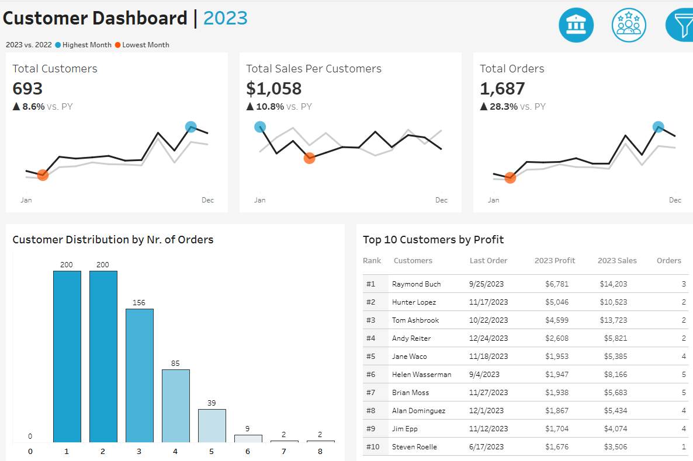
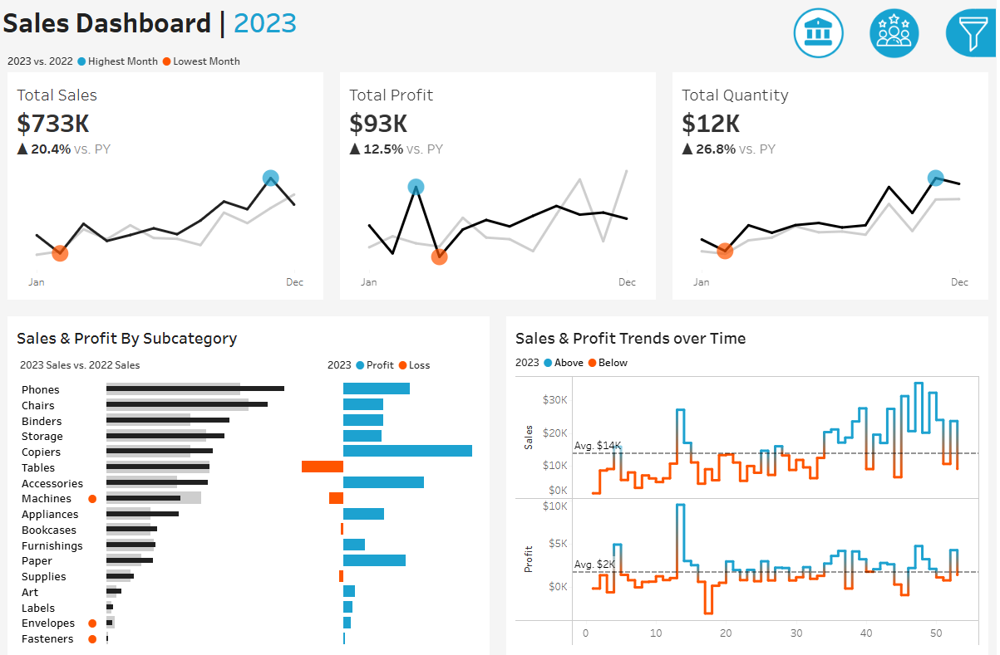

## Company Customer and Sales Report

Built paired **Tableau dashboards** for 2023 business performance: a customer view tracking acquisition, order frequency, and top accounts, and a sales view covering revenue, profit, quantity, and subcategory trends. Year-over-year comparisons and monthly sparklines highlight growth patterns and areas needing attention.

**Tools:** Tableau, sales analytics, customer analytics  
**Live dashboards:** [Customer Dashboard](https://public.tableau.com/views/Customerdashboard_17831061210010/CustomerDashboard) · [Sales Dashboard](https://public.tableau.com/views/CompanySalesdashboard/SalesDashboard)  

---

## Key Visualizations

### Customer dashboard
2023 customer KPIs: **693 total customers** (+8.6% vs. prior year), **$1,058** sales per customer (+10.8%), and **1,687 orders** (+28.3%). Monthly sparklines compare 2023 to 2022. Order-frequency bars show most customers place 1–2 orders, while a top-10 table ranks accounts by profit (Raymond Buch leads at **$6,781** profit).

### Sales dashboard
2023 sales KPIs: **$733K** total sales (+20.4%), **$93K** profit (+12.5%), and **12K** units sold (+26.8%). Subcategory bars compare 2023 vs. 2022 sales; profit/loss highlights strong performers (Copiers, Accessories) vs. loss categories (Tables, Machines). Weekly step charts track sales and profit against averages, flagging mid-year dips and year-end recovery.

---

## Links

- [Tableau Customer Dashboard](https://public.tableau.com/views/Customerdashboard_17831061210010/CustomerDashboard)
- [Tableau Sales Dashboard](https://public.tableau.com/views/CompanySalesdashboard/SalesDashboard)

Dashboard creation inspired by and based on a YouTube tutorial from the Data With Baraa YouTube channel.
