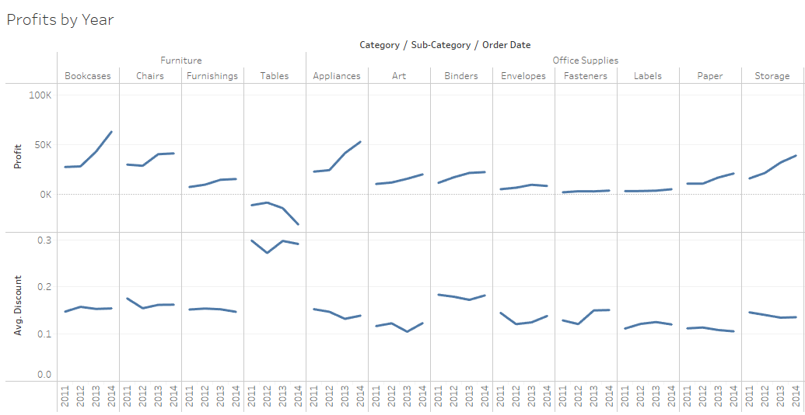
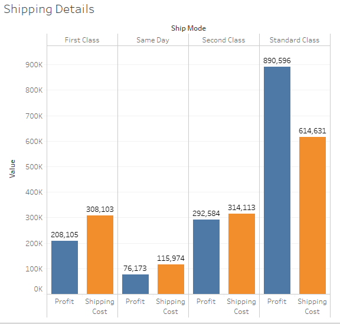
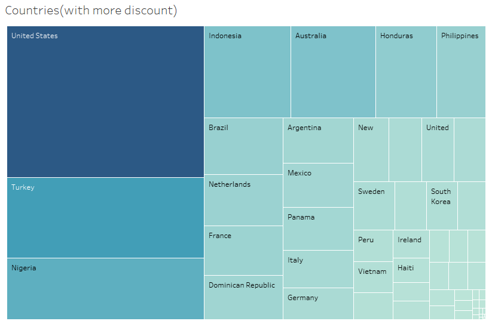
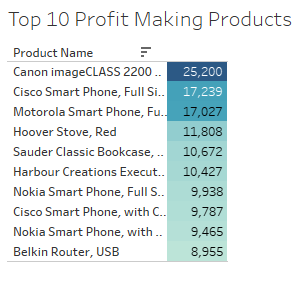
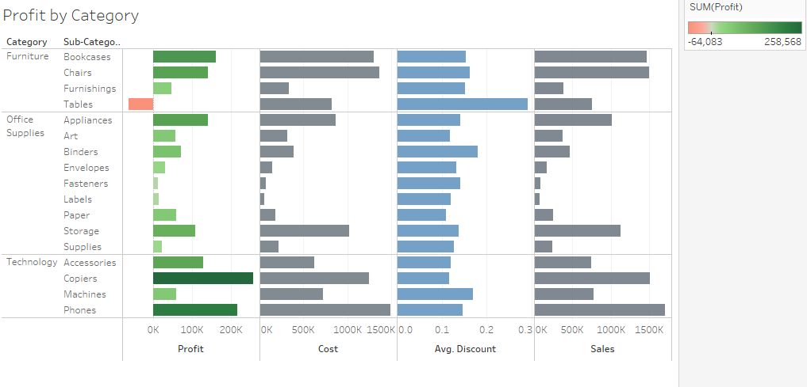

## Global Superstore Performance

Analyzed Global Superstore order data to determine which products, markets, and categories drove profit vs. loss. Built two **Tableau dashboards** covering profitability, shipping, and discount impact.

**Tools:** Tableau, business analytics, profitability analysis  
**Live dashboards:** [Dashboard 3](https://public.tableau.com/profile/smit106059#!/vizhome/GlobalPerfomanceDashboard3/GlobalPerfomance) · [Dashboard 4](https://public.tableau.com/profile/smit106059#!/vizhome/ShippingandDiscountdetailsDashboard4/ShippingandDiscount)  
**Repo:** [GitHub](https://github.com/smit-collab/Tableau-Visualizations)

---

## Key Visualizations

### Countries making profit

### Profits by year

### Shipping details

### Countries with highest discounts

### Top 10 profit-making products

### Profits by category

---

## Links

- [Tableau Dashboard 3](https://public.tableau.com/profile/smit106059#!/vizhome/GlobalPerfomanceDashboard3/GlobalPerfomance)
- [Tableau Dashboard 4](https://public.tableau.com/profile/smit106059#!/vizhome/ShippingandDiscountdetailsDashboard4/ShippingandDiscount)
- [GitHub repository](https://github.com/smit-collab/Tableau-Visualizations)
