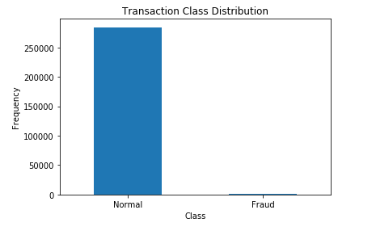
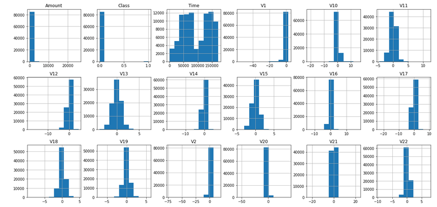
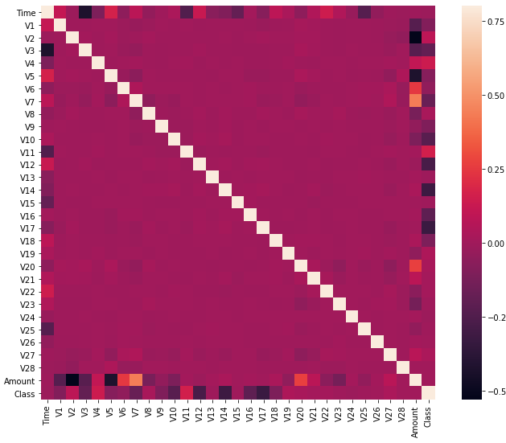

## Detail Information about the Project

**Project description:**  
Credit card fraud is when someone uses your credit card or credit account to make a purchase you didn't authorize. Credit card fraud is a fraud committed using a payment card, such as a credit card as a fraudulent source of funds in a transaction. Mainly I have used two important algorithms to find the accuracy of the model:
a.) local outlier factor to calculate anomaly scores 
b.) isolation algorithms.

### 1. Transaction class distribution

 

### 2. Exploring data visually

 

### 3. Correlation matrix

 

For more details see [Credit-Card-Fraud-Detection](https://github.com/smit-collab/Credit-Card-Fraud-Detection).
