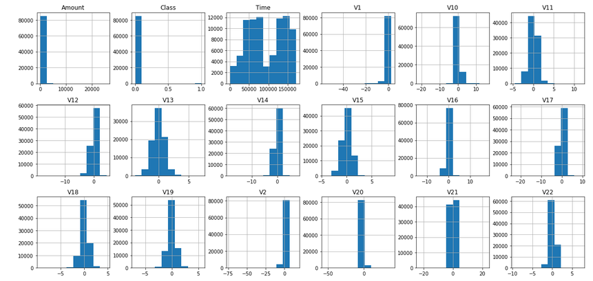
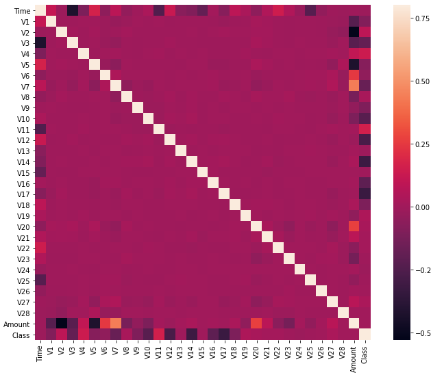

## Credit Card Fraud Detection

Built an anomaly detection pipeline to identify fraudulent credit card transactions on a highly imbalanced dataset. Compared **Local Outlier Factor (LOF)** and **Isolation Forest** to flag transactions that deviate from normal spending patterns.

**Tools:** Python, scikit-learn, LOF, Isolation Forest  
**Repo:** [GitHub](https://github.com/smit-collab/Credit-Card-Fraud-Detection)

---

## Key Visualizations

### Transaction class distribution

The dataset is heavily skewed toward legitimate transactions, making class imbalance a core challenge.

### Exploratory data analysis

Visual exploration of feature distributions to understand separation between normal and fraudulent transactions.

### Correlation matrix

Feature correlation analysis to identify redundant variables and inform model selection.

---

## Approach

1. Explored class imbalance and transaction feature distributions
2. Applied LOF to score anomaly likelihood per transaction
3. Used Isolation Forest as a complementary unsupervised detector
4. Evaluated detection performance on the imbalanced dataset

---

## Links

- [GitHub repository](https://github.com/smit-collab/Credit-Card-Fraud-Detection)
