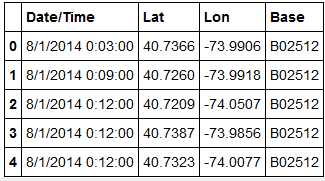
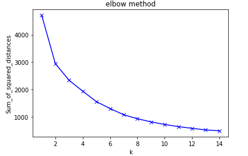
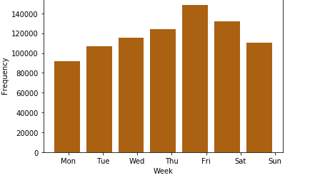
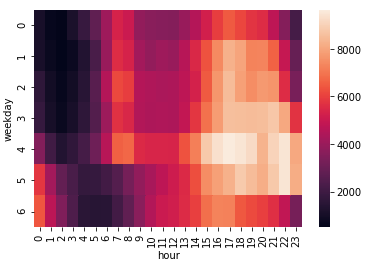

## Uber NYC Pickup Analysis

Analyzed 829,275 Uber pickup records across New York City's five boroughs using **K-Means clustering** to identify high-demand ride hubs and understand temporal pickup patterns.

**Tools:** Python, K-Means, pandas, seaborn, geospatial visualization  
**Repo:** [GitHub](https://github.com/smit-collab/Data-analysis-for-Uber-trips)

---

## Key Visualizations

### Dataset overview

Four columns and 829K+ observations covering pickup locations across NYC boroughs.

### Cluster centroids on map

Seven centroids plotted as potential hub locations for new ride requests.

### Elbow method for optimal K

Used the elbow method to determine the optimal number of clusters.

### Weekday and frequency analysis

Pickup frequency patterns broken down by day of the week.

### Hour and day heatmap

Combined hour-of-day and day-of-week analysis using seaborn.

---

## Key Results

- Identified 7 geographic clusters representing high-demand pickup zones
- Revealed weekday vs. weekend demand differences
- Mapped hourly pickup intensity to inform fleet positioning

---

## Links

- [GitHub repository](https://github.com/smit-collab/Data-analysis-for-Uber-trips)
