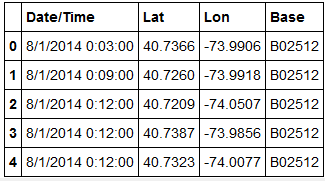

### Project Description:
In this project, I have analyzed the Uber Pickups in New York City. The dataset is obtained from the kaggle. New York City has five boroughs: Brooklyn, Queens, Manhattan, Bronx, and Staten Island. I have applied K means clustering algorithm to understand the trips taken on uber in New York City.

### Images

### 1. There are 4 columns in the data and 829,275 observations. Only a few observations are shown here.
 

### 2. All seven centroids are plotted on the map which can act as a hub for the new requested uber rides.
 

### 3. Elbow method is used to find the optimal value of k by fitting the model with a range of values for K
 

### 4. Analyzing the data by weekday and Frequency.
 

### 5. Analyzing hour and day together using seaborn chart.
 

For more details see [Analysis of Uber trips](https://github.com/smit-collab/Data-analysis-for-Uber-trips).

