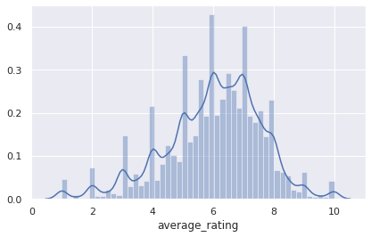
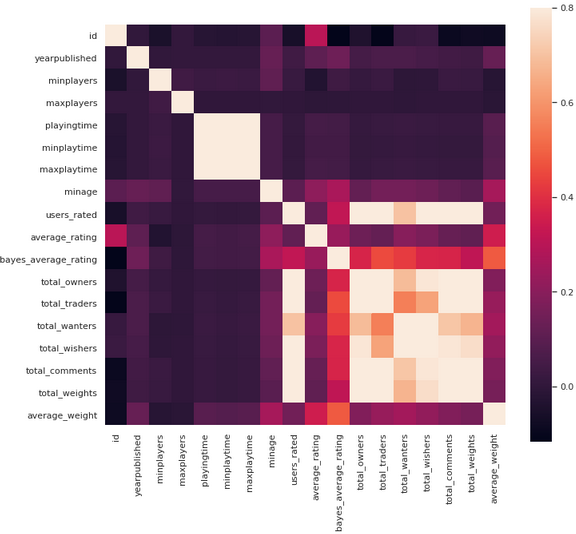
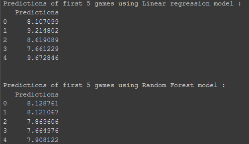

### Project Description:
In this project, I have I have used two models Linear Regression and Random Forest Regressor to predict the average ratings for the board games. The dataset is obtained from the kaggle. The project can be useful for the board games manufacturer who might want to know what types of games people like and which games got the highest ratings. Aim of the project is to use machine learning algorithms to predict average ratings for the board games.

### Images

### 1. The below chart shows average rating that most of the rating lies around 6. So after calculation we get.
 

    Standard Deviation :  1.5788299348332662
    Average :  6.016112849333889

### 2. Correlation Matrix shows some information on correlation coefficients between sets of variables in the data set.

From Below chart we can observe some basic things like id has some correlation with average rating. Also average rating and average weight are also correlated. Also min age is correlated with average rating.

Some columns like base type,name,id as they dont give useful info about the game. but they are correlated so it will somewhat affect the results of the algorithm.

 

### 3. Two models are used for the prediction of average rating of the board games : Linear Regression and Random Forest Regressor

 

### Key Points

• I have used two models Linear Regression and Random Forest Regressor to predict the average ratings for the board games.Using Linear Regression we got MSE 2.08 which is not the best as the data is fairly complex so the linear model won't fit it perfectly.

• Using Random Forest Regressor I get MSE value as 1.56 which is better than the linear regression. So non linear model is achiving better result than the linear model. Predictions of some values are shown below :

For more details see [Board Game Review Prediction](https://github.com/smit-collab/Board-games-prediction).

