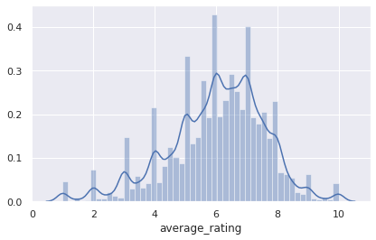
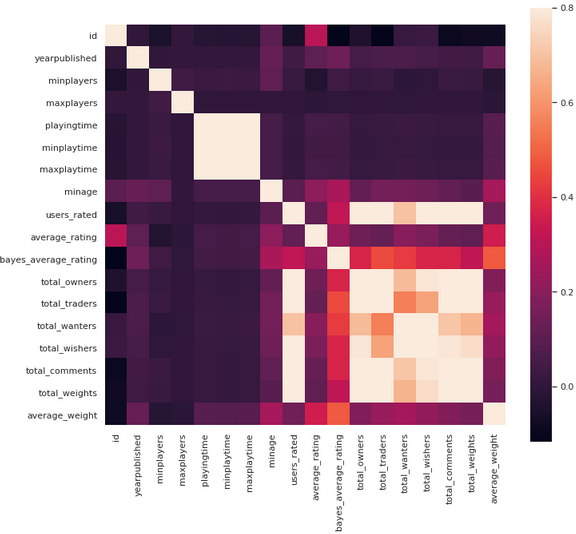
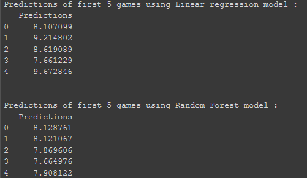

## Board Game Review Prediction

Predicted average board game ratings using **Linear Regression** and **Random Forest Regressor** on Kaggle board game data. The project helps identify which game features correlate most strongly with player ratings.

**Tools:** Python, scikit-learn, pandas, Kaggle dataset  
**Repo:** [GitHub](https://github.com/smit-collab/Board-games-prediction)

---

## Key Visualizations

### Rating distribution

Most ratings cluster around 6.0 (avg: 6.02, std: 1.58), indicating a left-skewed distribution.

### Feature correlation matrix

Average rating correlates with average weight and minimum age. Metadata columns like `id` and `name` show correlation but carry little predictive value.

### Model comparison

Side-by-side comparison of Linear Regression vs. Random Forest predictions.

---

## Key Results

| Model | MSE |
|-------|-----|
| Linear Regression | 2.08 |
| Random Forest | 1.56 |

Random Forest outperformed Linear Regression, confirming the non-linear relationships in the feature space.

---

## Links

- [GitHub repository](https://github.com/smit-collab/Board-games-prediction)
