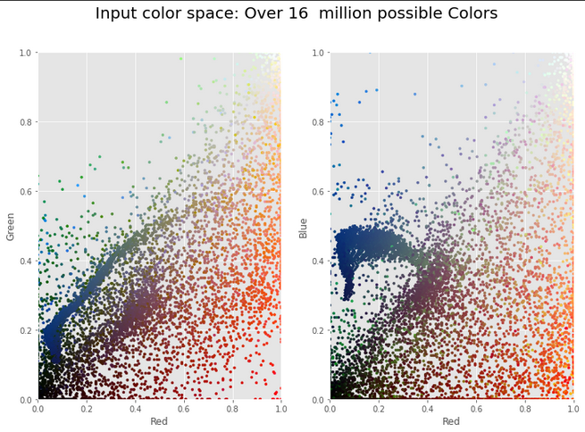
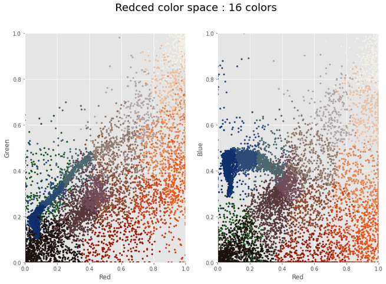
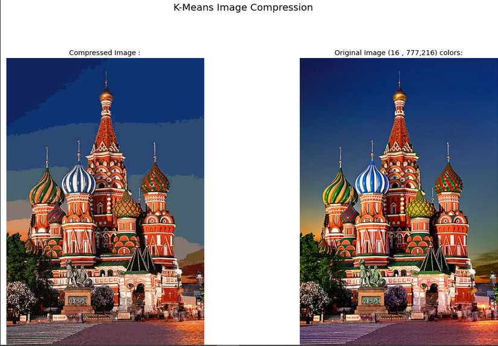

## Image Compression with K-Means

Demonstrated lossy image compression using **K-Means clustering** to reduce millions of pixel colors down to a user-selected K palette. Built as part of a Coursera machine learning course with an interactive slider to adjust compression level.

**Tools:** Python, K-Means, NumPy, interactive visualization  
**Repo:** [GitHub](https://github.com/smit-collab/Image-Compression-using-K-Means)

---

## Key Visualizations

### Original color space (16M+ colors)

Smooth color transitions across the full RGB color space.

### Reduced color space

After clustering, clear color banding with only 16 representative colors (default K=16).

### Interactive compression comparison

Side-by-side original vs. compressed image. K value adjustable via slider.

---

## How It Works

1. Treat each pixel as a point in RGB color space
2. Run K-Means to find K cluster centroids (representative colors)
3. Replace every pixel with its nearest centroid color
4. Result: smaller color palette → lossy but smaller image

Higher K values preserve more detail at the cost of less compression.

---

## Links

- [GitHub repository](https://github.com/smit-collab/Image-Compression-using-K-Means)
