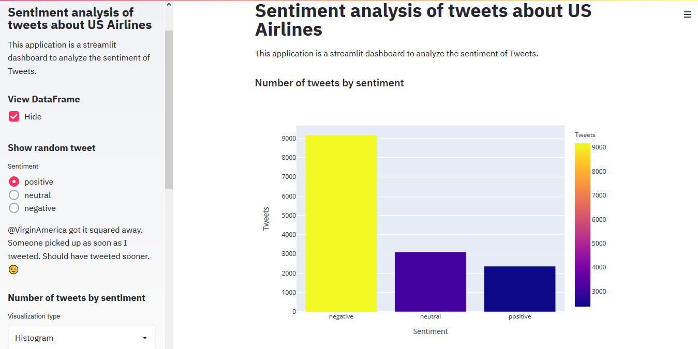
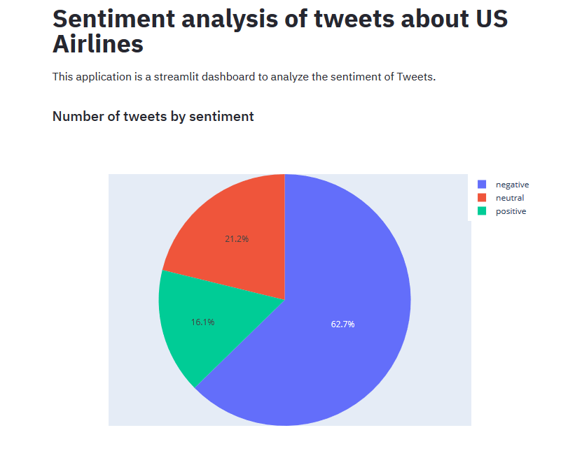
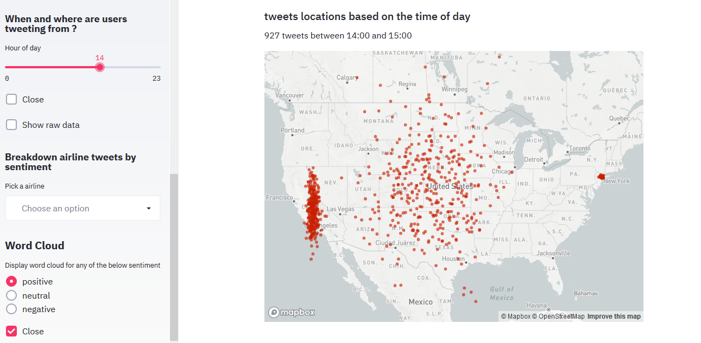
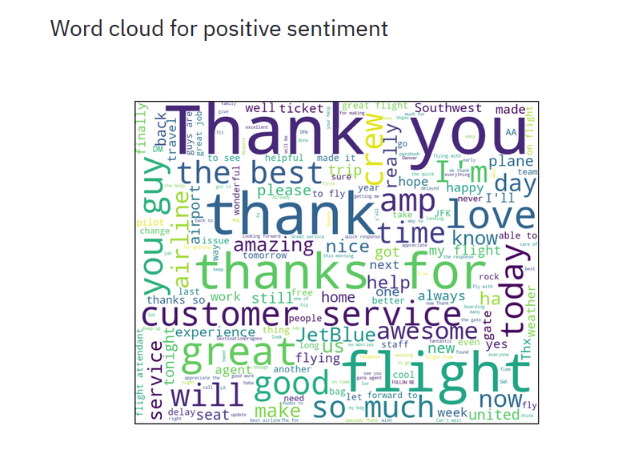

## US Airlines Sentiment Analysis

Built an interactive Streamlit app to analyze how travelers expressed sentiment about six major US airlines on Twitter: US Airways, United, American, Southwest, Delta, and Virgin America.

**Tools:** Python, Streamlit, NLP, data visualization  
**Repo:** [GitHub](https://github.com/smit-collab/Sentiment-analysis-of-tweets-about-US-Airlines)

---

## Dashboard Demo

The Streamlit dashboard lets users filter by sentiment, explore tweets by time and location, and view word clouds.

---

## Key Visualizations

### Sentiment distribution

Histogram of positive, negative, and neutral tweets. The dataset contains 9,178 negative, 3,099 neutral, and 2,363 positive tweets. Radio buttons let users browse random tweets by sentiment.

### Sentiment breakdown

Pie chart showing the percentage of each sentiment type.

### Tweets by location and hour

Map view of tweet volume by location, with a slider to filter by hour of day.

### Word cloud

Word cloud for neutral sentiment tweets.

---

## References

- Wikipedia
- DataCamp
- Coursera
- [GitHub repo](https://github.com/smit-collab/Sentiment-analysis-of-tweets-about-US-Airlines)
